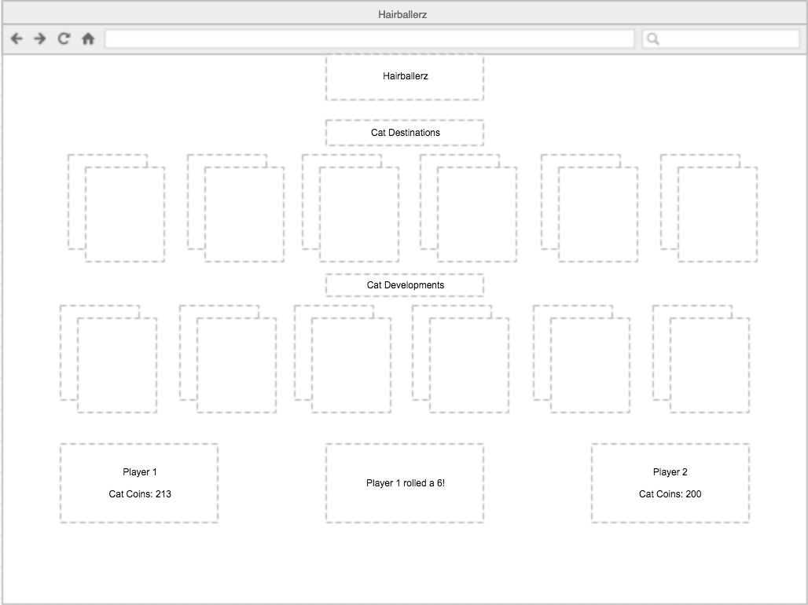

#Hairballerz
####[See the game here] (http://jjkeith.github.io/Project1/)

**Hairballerz is a cat-themed real estate card game. The goal of Hairballerz is to collect establishments that will earn rent. Once enough cat coinz(ξ) is collected in rent, players can invest in destinations that will increase their establishments' rent and get them closer to winning the title of Chief Hairballer.**

###Inspiration
The idea for Hairballerz came from my seven-year-old daughter after playing Machi Koro, a much more complicated Japanese card game that, sadly, has little to nothing to do with cats. She and I came up with a game that is simpler and is quicker to play... and also has 500% more cats. The original game was made on paper, but her first-grade friends found keeping score too difficult, so I sought to make a Javascript-based version.

###Instructions

#####Cat Establishments
* Players may obtain up to two of each.
* Players can only buy the card that corresponds with their role.
* When a player obtains a property, the card changes to the player's color and the player begins making rent whenever the card's number is rolled.

1. The Veterinary Offices of Katz & Nuzzle - Costs 1ξ and earns 1ξ when a 1 is rolled.
2. Tuna 'R' Us — Costs 2ξ and earns 2ξ when a 2 is rolled
3. Purrfect Coif Groomer — Costs 3ξ and earns 3ξ when a 3 is rolled
4. Clawsitive Reinforcement Training Academy — Costs 4ξ and earns 4ξ when a 4 is rolled
5. Pawsplay Costume Rentals — Costs 5ξ and earns 5ξ when a 5 is rolled
6. Flea Strasburg Acting School — Costs 6ξ and earns 6ξ when a 6 is rolled

#####Cat Destinations
* Players may only have one of each.
* Cards must be bought in order.
* When a player obtains a development, the card changes to the player's color, and the player is able to earn 1ξ per establishment owned of the corresponding number.

1. Catnip Dispensary - Costs 10ξ, earns 1ξ extra on The Veterinary Offices of Katz & Nuzzle
2. Tuna Cannery - Costs 15ξ, earns 1ξ extra on the Tuna 'R' Us
3. Catapult Magazine Headquarters - Costs 20ξ, earns 1ξ extra on Purrfect Coif Groomer
4. Paw-trait Studio - Costs 25ξ, earns 1ξ extra on Clawsitive Reinforcement Training Academy
5. CatCon Venue- Costs 30ξ, earns 1ξ extra on Pawsplay Costume Rentals
6. WCAT Television Station - Costs 35ξ

#####On Each Roll
1. Both players collect rent on any cards held.
2. The active player may choose to buy one property per turn.
3. Whoever buys the WCAT Television Studio first, wins!

###Screenshots
![] (screenshot1.jpg)
The game at start.
![] (screenshot2.jpg)
A modal with some properties already purchased.

###Development
My original plan for laying out the screen was to put player info at the bottom of the page as below. However, I switched it around because I felt that having that information at the top was more intuitive.

###Technology
Hairballerz was created with HTML, CSS, Javascript, jQuery, and Bootstrap. The game board remains static, with colors changing when properties are purchased. Modals guide the player through starting the game and making decisions about property purchasing.

###Known Issues
* The modal covers Player 2's balance so the user can't see when it blinks to indicate that rent has been earned.

###Credits
* Rules and theme: Beatrix Keith
* Inspiration: Machi Koro © IDW Games, 2015
* Color scheme from [Coolors] (https://coolors.co/app/4c9de0-e05353-e0bb28-3ab272-7768ad).

##Future Plans
* Starter cards that are dealt at random and change the occasions or properties upon which rent can be collected
* Include an option to play against the computer
* Add key commands that provide input to the modal
* For each establishment, make four cards available and accordingly raise the prices on the destinations
